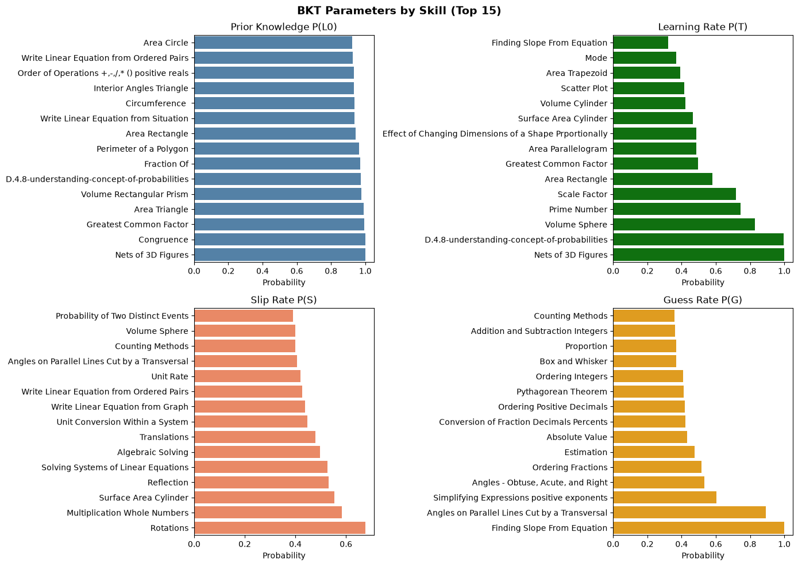
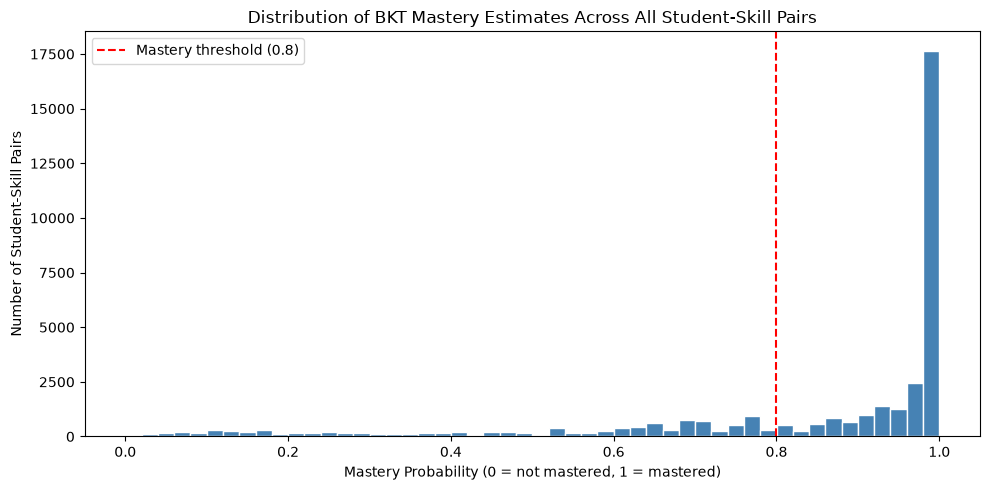
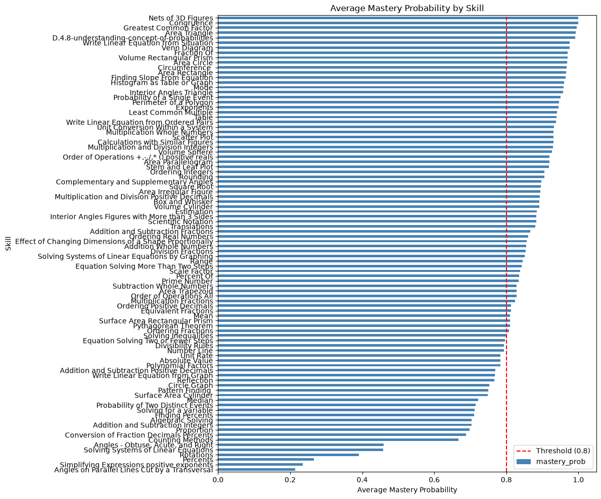

## SECTION 1 — Load Clean Data

**Why:** Always load from the saved clean file, never re-run preprocessing. This guarantees notebook 03 always uses exactly the same data.


```python
# Cell 1 — Load clean data
import pandas as pd
import numpy as np
import matplotlib.pyplot as plt
import seaborn as sns

df = pd.read_csv('../outputs/clean_data.csv')

print("Clean data loaded.")
print("Shape:", df.shape)
print("Students:", df['user_id'].nunique())
print("Skills:", df['skill_name'].nunique())
print("Sample:")
```

    Clean data loaded.
    Shape: (294418, 9)
    Students: 3053
    Skills: 92
    Sample:
    

## SECTION 2 — Check Data Format for pyBKT

**Why:** pyBKT expects specific column names. We verify our data matches before fitting.

Required columns:
- `user_id` → identifies the student
- `skill_name` → identifies the skill
- `correct` → 0 or 1, the student's response


```python
# Cell 2 — Verify data format
print("Required columns present:")
required = ['user_id', 'skill_name', 'correct']
for col in required:
    print(f"  {col}: {'YES' if col in df.columns else 'MISSING'}")

print("\ncorrect column values (should be only 0 and 1):")
print(df['correct'].value_counts())

print("\nSample student sequence (first student, first skill):")
first_student = df['user_id'].iloc[0]
first_skill = df[df['user_id'] == first_student]['skill_name'].iloc[0]
sample = df[(df['user_id'] == first_student) &
            (df['skill_name'] == first_skill)][
    ['user_id', 'skill_name', 'correct', 'opportunity']
]
print(sample)
```

    Required columns present:
      user_id: YES
      skill_name: YES
      correct: YES
    
    correct column values (should be only 0 and 1):
    correct
    1    194415
    0    100003
    Name: count, dtype: int64
    
    Sample student sequence (first student, first skill):
        user_id    skill_name  correct  opportunity
    0        14  Circle Graph        0            1
    2        14  Circle Graph        1            2
    4        14  Circle Graph        0            3
    6        14  Circle Graph        0            4
    8        14  Circle Graph        0            5
    10       14  Circle Graph        0            6
    12       14  Circle Graph        0            7
    15       14  Circle Graph        0            8
    18       14  Circle Graph        1            9
    20       14  Circle Graph        0           10
    23       14  Circle Graph        1           11
    25       14  Circle Graph        0           12
    

## SECTION 3 — Fit BKT Model

**Why:** pyBKT fits one BKT model per skill using Expectation-Maximization (EM) to estimate 4 parameters (L0, T, S, G) that best explain each skill's response patterns.

You do NOT fit one model per student — you fit one model per skill, then use it to estimate each individual student's mastery.

**Thesis note:** "BKT parameters were estimated using the Expectation-Maximization algorithm implemented in the pyBKT library, with 5 random restarts to avoid local optima."


```python
# Cell 3 — Fit BKT model
import importlib
from pyBKT.fit import EM_fit, predict_onestep
importlib.reload(EM_fit)
importlib.reload(predict_onestep)
from pyBKT.models import Model

# seed=42 ensures reproducible results
# num_fits=5 tries 5 random starting points and picks the best
model = Model(seed=42, num_fits=1, parallel=False)

print("Fitting BKT model on all skills...")
print("This may take 1-3 minutes...")

# skills='.*' is a regex matching all skill names in the skill_name column
model.fit(data=df, skills='.*')
fit_params = model.params()
if not np.isfinite(fit_params['value']).all():
    raise RuntimeError('BKT fitting produced non-finite parameters')

# Keep wildcard selection for predict(); pyBKT otherwise joins skill names
# into an unescaped regex and can omit names containing +, *, or parentheses.
model.skills = '.*'
print("\nBKT model fitted successfully with finite parameters!")
```

    Fitting BKT model on all skills...
    This may take 1-3 minutes...
    
    BKT model fitted successfully with finite parameters!
    

## SECTION 4 — Inspect Fitted Parameters

**Why:** The 4 parameters per skill are scientifically meaningful. They tell us about the difficulty and learnability of each skill.

| Parameter | Low value means | High value means |
|---|---|---|
| prior (L0) | Most students start not knowing it | Most students already know it |
| learns (T) | Hard to learn — needs many attempts | Easy to learn — few attempts needed |
| slips (S) | Students rarely make careless errors | Many careless errors |
| guesses (G) | Hard to guess correctly | Easy to guess correctly |


```python
# Cell 4 — View fitted parameters per skill
params = model.params()
print("BKT parameters per skill:")
print(params)
```

    BKT parameters per skill:
                                                  value
    skill                       param   class          
    Percent Of                  prior   default 0.67436
                                learns  default 0.09925
                                guesses default 0.07655
                                slips   default 0.28591
                                forgets default 0.00000
    ...                                             ...
    Finding Slope From Equation prior   default 0.35888
                                learns  default 0.32274
                                guesses default 1.00000
                                slips   default 0.30889
                                forgets default 0.00000
    
    [460 rows x 1 columns]
    


```python
# Cell 5 — Visualize parameters for top 15 skills
# model.params() is long-form: skill, param, class, value. Pivot it so
# prior/learns/slips/guesses become numeric columns that can be plotted.
params_plot = (
    params.reset_index()
    .pivot_table(index='skill', columns='param', values='value', aggfunc='first')
    .reset_index()
)
metrics = ['prior', 'learns', 'slips', 'guesses']
missing_metrics = [metric for metric in metrics if metric not in params_plot.columns]
if missing_metrics:
    raise RuntimeError(f'Missing BKT parameter columns: {missing_metrics}')
if not np.isfinite(params_plot[metrics].to_numpy()).all():
    raise RuntimeError('Cannot plot non-finite BKT parameters')

print('Plot columns:', params_plot.columns.tolist())

fig, axes = plt.subplots(2, 2, figsize=(14, 10))
titles  = ['Prior Knowledge P(L0)', 'Learning Rate P(T)',
           'Slip Rate P(S)', 'Guess Rate P(G)']
colors  = ['steelblue', 'green', 'coral', 'orange']

for ax, metric, title, color in zip(axes.flatten(), metrics, titles, colors):
    top = params_plot.nlargest(15, metric).sort_values(metric)
    sns.barplot(data=top, x=metric, y='skill', color=color, ax=ax)
    ax.set_title(title)
    ax.set_xlabel('Probability')
    ax.set_ylabel('')

plt.suptitle('BKT Parameters by Skill (Top 15)', fontsize=14, fontweight='bold')
plt.tight_layout()
plt.savefig('../outputs/figures/bkt_parameters.png', dpi=150)
plt.show()
print("Parameter chart saved!")
```

    Plot columns: ['skill', 'forgets', 'guesses', 'learns', 'prior', 'slips']
    


    

    


    Parameter chart saved!
    

## SECTION 5 — Generate Mastery Estimates

**Why:** After fitting, we use the model to calculate the final mastery probability for each student on each skill they practiced.

`predict()` returns two new columns:
- `correct_predictions` — probability of answering the NEXT question correctly (used for evaluation in notebook 04)
- `state_predictions` — probability of being in the "learned" state at this point (the mastery estimate)


```python
# Cell 6 — Generate predictions
model.skills = '.*'
print("Generating mastery predictions...")
predictions = model.predict(data=df)
for column in ['correct_predictions', 'state_predictions']:
    if not np.isfinite(predictions[column]).all():
        raise RuntimeError(f'{column} contains non-finite values')

print("Predictions shape:", predictions.shape)
print("Prediction columns:", predictions.columns.tolist())
print("\nSample predictions:")
print(predictions.head(10))
```

    Generating mastery predictions...
    Predictions shape: (294418, 11)
    Prediction columns: ['user_id', 'skill_name', 'correct', 'opportunity', 'hint_count', 'attempt_count', 'order_id', 'original', 'ms_first_response', 'correct_predictions', 'state_predictions']
    
    Sample predictions:
       user_id    skill_name  correct  opportunity  hint_count  attempt_count  \
    0       14  Circle Graph        0            1           2              1   
    1       14    Percent Of        0            1           2              1   
    2       14  Circle Graph        1            2           0              1   
    3       14    Percent Of        1            2           0              1   
    4       14  Circle Graph        0            3           2              1   
    5       14    Percent Of        0            3           2              1   
    6       14  Circle Graph        0            4           2              1   
    7       14    Percent Of        0            4           2              1   
    8       14  Circle Graph        0            5           2              1   
    9       14    Percent Of        0            5           2              1   
    
       order_id  original  ms_first_response  correct_predictions  \
    0  21617623         1              26271              0.46861   
    1  21617623         1              26271              0.50648   
    2  21617632         1              29123              0.33989   
    3  21617632         1              29123              0.36418   
    4  21617641         1              13779              0.57127   
    5  21617641         1              13779              0.64784   
    6  21617650         1              16901              0.44739   
    7  21617650         1              16901              0.55761   
    8  21617659         1              11079              0.32266   
    9  21617659         1              11079              0.41987   
    
       state_predictions  
    0            0.58300  
    1            0.67436  
    2            0.35883  
    3            0.45116  
    4            0.76180  
    5            0.89609  
    6            0.54605  
    7            0.75456  
    8            0.32881  
    9            0.53851  
    

## SECTION 6 — Extract Final Mastery Per Student Per Skill

**Why:** `predict()` gives mastery at every timestep. We only want the FINAL mastery estimate — the last value after all interactions. This represents where the student ended up.


```python
# Cell 7 — Extract final mastery estimate per student per skill
mastery = predictions.groupby(
    ['user_id', 'skill_name']
).agg(
    mastery_prob=('state_predictions', 'last'),
    n_opportunities=('opportunity', 'max'),
    correct_rate=('correct', 'mean')
).reset_index()

print("Mastery estimates shape:", mastery.shape)
print(f"\nTotal student-skill pairs: {len(mastery)}")
print("\nSample mastery estimates:")
print(mastery.head(10))

print("\nMastery probability statistics:")
print(mastery['mastery_prob'].describe())
```

    Mastery estimates shape: (37019, 5)
    
    Total student-skill pairs: 37019
    
    Sample mastery estimates:
       user_id                            skill_name  mastery_prob  \
    0       14                          Circle Graph       0.62124   
    1       14                  Equivalent Fractions       0.92789   
    2       14                      Finding Percents       0.20624   
    3       14                                Median       0.12635   
    4       14                            Percent Of       0.33831   
    5       14                            Proportion       0.27010   
    6       14                                 Range       0.96618   
    7    21825                                  Mean       0.99603   
    8    21825                                Median       0.53607   
    9    21825  Multiplication and Division Integers       1.00000   
    
       n_opportunities  correct_rate  
    0               12       0.25000  
    1                6       0.33333  
    2                2       0.00000  
    3                4       0.00000  
    4                6       0.16667  
    5                2       0.00000  
    6                3       1.00000  
    7                4       0.75000  
    8                3       0.33333  
    9               10       1.00000  
    
    Mastery probability statistics:
    count   37,019.00000
    mean         0.83883
    std          0.24895
    min          0.00005
    25%          0.76165
    50%          0.97335
    75%          0.99969
    max          1.00000
    Name: mastery_prob, dtype: float64
    

## SECTION 7 — Visualize Mastery Distribution

**Why:** We expect a spread of mastery values — some students mastered skills, others did not. If all values cluster near 0.5, something is wrong.

**Mastery threshold of 0.8:** Standard in BKT research — if P(mastered) >= 0.8, the student has mastered the skill.

**Thesis note:** "Following standard practice in BKT research, a mastery threshold of 0.8 was applied to classify knowledge component mastery."


```python
# Cell 8 — Distribution of mastery probabilities
plt.figure(figsize=(10, 5))
plt.hist(mastery['mastery_prob'], bins=50,
         color='steelblue', edgecolor='white')
plt.title('Distribution of BKT Mastery Estimates Across All Student-Skill Pairs')
plt.xlabel('Mastery Probability (0 = not mastered, 1 = mastered)')
plt.ylabel('Number of Student-Skill Pairs')
plt.axvline(x=0.8, color='red', linestyle='--',
            label='Mastery threshold (0.8)')
plt.legend()
plt.tight_layout()
plt.savefig('../outputs/figures/mastery_distribution.png', dpi=150)
plt.show()

threshold = 0.8
mastered = (mastery['mastery_prob'] >= threshold).sum()
total = len(mastery)
print(f"\nStudent-skill pairs above mastery threshold ({threshold}):")
print(f"  {mastered} out of {total} ({round(mastered/total*100, 1)}%)")
```


    

    


    
    Student-skill pairs above mastery threshold (0.8):
      26593 out of 37019 (71.8%)
    


```python
# Cell 9 — Average mastery per skill
skill_mastery = mastery.groupby('skill_name')['mastery_prob'].mean().sort_values()

plt.figure(figsize=(12, 10))
skill_mastery.plot(kind='barh', color='steelblue')
plt.title('Average Mastery Probability by Skill')
plt.xlabel('Average Mastery Probability')
plt.ylabel('Skill')
plt.axvline(x=0.8, color='red', linestyle='--', label='Threshold (0.8)')
plt.legend()
plt.tight_layout()
plt.savefig('../outputs/figures/mastery_by_skill.png', dpi=150)
plt.show()
```


    

    


## SECTION 8 — Save Mastery Estimates

**Why:** This file is the bridge to everything after. Notebook 04 (evaluation) uses `correct_predictions` to measure accuracy. Notebook 05 (recommendations) uses `mastery_prob` to identify knowledge gaps.


```python
# Cell 10 — Save mastery estimates
output_path = '../outputs/mastery_estimates.csv'
mastery.to_csv(output_path, index=False)

print(f"Mastery estimates saved to: {output_path}")
print(f"Shape: {mastery.shape}")
print("\nColumns saved:")
for col in mastery.columns:
    print(f"  - {col}")
print("\nDone! Ready for notebook 04 — Evaluation.")
```

    Mastery estimates saved to: ../outputs/mastery_estimates.csv
    Shape: (37019, 5)
    
    Columns saved:
      - user_id
      - skill_name
      - mastery_prob
      - n_opportunities
      - correct_rate
    
    Done! Ready for notebook 04 — Evaluation.
    
